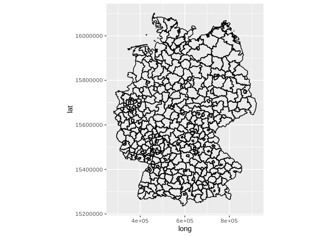

<!-- README.md is generated from README.Rmd. Please edit that file -->
geodatenzentrum
===============

The goal of geodatenzentrum is to ...

Installation
------------

tbd

Example
-------

``` r
library(geodatenzentrum)
```

### Create a `geodatenzentrum` object

``` r
GDZ <- geodatenzentrum$new(local_file_root = "/home/philipp/gdz")
GDZ
#> <geodatenzentrum>
#> 
#> Local file root: /home/philipp/gdz
#> 
#> Available sources: VG250, VG250_EW, KFZ250, 
#> 
#> Reference: http://www.geodatenzentrum.de/
```

### Sync a datasource

``` r
GDZ$sync(source = "VG250")
#> 
#> Thu Aug 15 22:20:08 2019
#> Synchronizing dataset: VG250
#> Source URL http://sg.geodatenzentrum.de/web_download/vg/vg250_0101/utm32s/shape/vg250_0101.utm32s.shape.ebenen.zip
#> --------------------------------------------------------------------------------------------
#> 
#>  this dataset path is: /home/philipp/gdz/sg.geodatenzentrum.de/web_download/vg/vg250_0101/utm32s/shape
#>  building file list ... done.
#>  downloading file 1 of 1: http://sg.geodatenzentrum.de/web_download/vg/vg250_0101/utm32s/shape/vg250_0101.utm32s.shape.ebenen.zip ...  file unchanged on server, not downloading.
#>   decompressing: /home/philipp/gdz/sg.geodatenzentrum.de/web_download/vg/vg250_0101/utm32s/shape/vg250_0101.utm32s.shape.ebenen.zip ... no new files to extract (not overwriting existing files) ... done.
#> 
#> Thu Aug 15 22:20:09 2019 dataset synchronization complete: VG250
```

### List downloaded files

``` r
GDZ$files(collection = "VG250")
#>  [1] "/home/philipp/gdz/sg.geodatenzentrum.de/web_download/vg/vg250_0101/utm32s/shape/vg250_0101.utm32s.shape.ebenen.zip"                                                 
#>  [2] "/home/philipp/gdz/sg.geodatenzentrum.de/web_download/vg/vg250_0101/utm32s/shape/vg250_0101.utm32s.shape.ebenen/"                                                    
#>  [3] "/home/philipp/gdz/sg.geodatenzentrum.de/web_download/vg/vg250_0101/utm32s/shape/vg250_0101.utm32s.shape.ebenen/datenlizenz_deutschland_v2_0.pdf"                    
#>  [4] "/home/philipp/gdz/sg.geodatenzentrum.de/web_download/vg/vg250_0101/utm32s/shape/vg250_0101.utm32s.shape.ebenen/dokumentation/"                                      
#>  [5] "/home/philipp/gdz/sg.geodatenzentrum.de/web_download/vg/vg250_0101/utm32s/shape/vg250_0101.utm32s.shape.ebenen/dokumentation/struktur_und_attribute.xls"            
#>  [6] "/home/philipp/gdz/sg.geodatenzentrum.de/web_download/vg/vg250_0101/utm32s/shape/vg250_0101.utm32s.shape.ebenen/dokumentation/vg250_eng.pdf"                         
#>  [7] "/home/philipp/gdz/sg.geodatenzentrum.de/web_download/vg/vg250_0101/utm32s/shape/vg250_0101.utm32s.shape.ebenen/dokumentation/hinweise_zur_verwaltungsgliederung.pdf"
#>  [8] "/home/philipp/gdz/sg.geodatenzentrum.de/web_download/vg/vg250_0101/utm32s/shape/vg250_0101.utm32s.shape.ebenen/dokumentation/vg250.pdf"                             
#>  [9] "/home/philipp/gdz/sg.geodatenzentrum.de/web_download/vg/vg250_0101/utm32s/shape/vg250_0101.utm32s.shape.ebenen/vg250_ebenen/"                                       
#> [10] "/home/philipp/gdz/sg.geodatenzentrum.de/web_download/vg/vg250_0101/utm32s/shape/vg250_0101.utm32s.shape.ebenen/vg250_ebenen/VG250_LAN.shp"                          
#> [11] "/home/philipp/gdz/sg.geodatenzentrum.de/web_download/vg/vg250_0101/utm32s/shape/vg250_0101.utm32s.shape.ebenen/vg250_ebenen/VG250_KRS.shx"                          
#> [12] "/home/philipp/gdz/sg.geodatenzentrum.de/web_download/vg/vg250_0101/utm32s/shape/vg250_0101.utm32s.shape.ebenen/vg250_ebenen/VG250_LI.prj"                           
#> [13] "/home/philipp/gdz/sg.geodatenzentrum.de/web_download/vg/vg250_0101/utm32s/shape/vg250_0101.utm32s.shape.ebenen/vg250_ebenen/VG250_PK.cpg"                           
#> [14] "/home/philipp/gdz/sg.geodatenzentrum.de/web_download/vg/vg250_0101/utm32s/shape/vg250_0101.utm32s.shape.ebenen/vg250_ebenen/VG250_PK.shp"                           
#> [15] "/home/philipp/gdz/sg.geodatenzentrum.de/web_download/vg/vg250_0101/utm32s/shape/vg250_0101.utm32s.shape.ebenen/vg250_ebenen/VG250_PK.prj"                           
#> [16] "/home/philipp/gdz/sg.geodatenzentrum.de/web_download/vg/vg250_0101/utm32s/shape/vg250_0101.utm32s.shape.ebenen/vg250_ebenen/VG250_GEM.cpg"                          
#> [17] "/home/philipp/gdz/sg.geodatenzentrum.de/web_download/vg/vg250_0101/utm32s/shape/vg250_0101.utm32s.shape.ebenen/vg250_ebenen/VG250_STA.shx"                          
#> [18] "/home/philipp/gdz/sg.geodatenzentrum.de/web_download/vg/vg250_0101/utm32s/shape/vg250_0101.utm32s.shape.ebenen/vg250_ebenen/VG250_GEM.shx"                          
#> [19] "/home/philipp/gdz/sg.geodatenzentrum.de/web_download/vg/vg250_0101/utm32s/shape/vg250_0101.utm32s.shape.ebenen/vg250_ebenen/VG_WERTE.dbf"                           
#> [20] "/home/philipp/gdz/sg.geodatenzentrum.de/web_download/vg/vg250_0101/utm32s/shape/vg250_0101.utm32s.shape.ebenen/vg250_ebenen/VG250_RBZ.shp"                          
#> [21] "/home/philipp/gdz/sg.geodatenzentrum.de/web_download/vg/vg250_0101/utm32s/shape/vg250_0101.utm32s.shape.ebenen/vg250_ebenen/VG_DATEN.CPG"                           
#> [22] "/home/philipp/gdz/sg.geodatenzentrum.de/web_download/vg/vg250_0101/utm32s/shape/vg250_0101.utm32s.shape.ebenen/vg250_ebenen/VG250_RBZ.shx"                          
#> [23] "/home/philipp/gdz/sg.geodatenzentrum.de/web_download/vg/vg250_0101/utm32s/shape/vg250_0101.utm32s.shape.ebenen/vg250_ebenen/VG250_RBZ.prj"                          
#> [24] "/home/philipp/gdz/sg.geodatenzentrum.de/web_download/vg/vg250_0101/utm32s/shape/vg250_0101.utm32s.shape.ebenen/vg250_ebenen/VG250_LI.cpg"                           
#> [25] "/home/philipp/gdz/sg.geodatenzentrum.de/web_download/vg/vg250_0101/utm32s/shape/vg250_0101.utm32s.shape.ebenen/vg250_ebenen/VG250_VWG.dbf"                          
#> [26] "/home/philipp/gdz/sg.geodatenzentrum.de/web_download/vg/vg250_0101/utm32s/shape/vg250_0101.utm32s.shape.ebenen/vg250_ebenen/VG250_KRS.prj"                          
#> [27] "/home/philipp/gdz/sg.geodatenzentrum.de/web_download/vg/vg250_0101/utm32s/shape/vg250_0101.utm32s.shape.ebenen/vg250_ebenen/VG250_LI.shp"                           
#> [28] "/home/philipp/gdz/sg.geodatenzentrum.de/web_download/vg/vg250_0101/utm32s/shape/vg250_0101.utm32s.shape.ebenen/vg250_ebenen/VG250_STA.prj"                          
#> [29] "/home/philipp/gdz/sg.geodatenzentrum.de/web_download/vg/vg250_0101/utm32s/shape/vg250_0101.utm32s.shape.ebenen/vg250_ebenen/VG250_VWG.cpg"                          
#> [30] "/home/philipp/gdz/sg.geodatenzentrum.de/web_download/vg/vg250_0101/utm32s/shape/vg250_0101.utm32s.shape.ebenen/vg250_ebenen/VG250_RBZ.cpg"                          
#> [31] "/home/philipp/gdz/sg.geodatenzentrum.de/web_download/vg/vg250_0101/utm32s/shape/vg250_0101.utm32s.shape.ebenen/vg250_ebenen/VG_WERTE.CPG"                           
#> [32] "/home/philipp/gdz/sg.geodatenzentrum.de/web_download/vg/vg250_0101/utm32s/shape/vg250_0101.utm32s.shape.ebenen/vg250_ebenen/VG250_LAN.cpg"                          
#> [33] "/home/philipp/gdz/sg.geodatenzentrum.de/web_download/vg/vg250_0101/utm32s/shape/vg250_0101.utm32s.shape.ebenen/vg250_ebenen/VG250_GEM.prj"                          
#> [34] "/home/philipp/gdz/sg.geodatenzentrum.de/web_download/vg/vg250_0101/utm32s/shape/vg250_0101.utm32s.shape.ebenen/vg250_ebenen/VG250_GEM.dbf"                          
#> [35] "/home/philipp/gdz/sg.geodatenzentrum.de/web_download/vg/vg250_0101/utm32s/shape/vg250_0101.utm32s.shape.ebenen/vg250_ebenen/VG250_PK.shx"                           
#> [36] "/home/philipp/gdz/sg.geodatenzentrum.de/web_download/vg/vg250_0101/utm32s/shape/vg250_0101.utm32s.shape.ebenen/vg250_ebenen/VG250_STA.cpg"                          
#> [37] "/home/philipp/gdz/sg.geodatenzentrum.de/web_download/vg/vg250_0101/utm32s/shape/vg250_0101.utm32s.shape.ebenen/vg250_ebenen/VG250_LI.shx"                           
#> [38] "/home/philipp/gdz/sg.geodatenzentrum.de/web_download/vg/vg250_0101/utm32s/shape/vg250_0101.utm32s.shape.ebenen/vg250_ebenen/VG250_LAN.shx"                          
#> [39] "/home/philipp/gdz/sg.geodatenzentrum.de/web_download/vg/vg250_0101/utm32s/shape/vg250_0101.utm32s.shape.ebenen/vg250_ebenen/VG_DATEN.dbf"                           
#> [40] "/home/philipp/gdz/sg.geodatenzentrum.de/web_download/vg/vg250_0101/utm32s/shape/vg250_0101.utm32s.shape.ebenen/vg250_ebenen/VG250_LAN.prj"                          
#> [41] "/home/philipp/gdz/sg.geodatenzentrum.de/web_download/vg/vg250_0101/utm32s/shape/vg250_0101.utm32s.shape.ebenen/vg250_ebenen/VG250_RBZ.dbf"                          
#> [42] "/home/philipp/gdz/sg.geodatenzentrum.de/web_download/vg/vg250_0101/utm32s/shape/vg250_0101.utm32s.shape.ebenen/vg250_ebenen/VG250_KRS.cpg"                          
#> [43] "/home/philipp/gdz/sg.geodatenzentrum.de/web_download/vg/vg250_0101/utm32s/shape/vg250_0101.utm32s.shape.ebenen/vg250_ebenen/VG250_STA.dbf"                          
#> [44] "/home/philipp/gdz/sg.geodatenzentrum.de/web_download/vg/vg250_0101/utm32s/shape/vg250_0101.utm32s.shape.ebenen/vg250_ebenen/VG250_VWG.prj"                          
#> [45] "/home/philipp/gdz/sg.geodatenzentrum.de/web_download/vg/vg250_0101/utm32s/shape/vg250_0101.utm32s.shape.ebenen/vg250_ebenen/VG250_GEM.shp"                          
#> [46] "/home/philipp/gdz/sg.geodatenzentrum.de/web_download/vg/vg250_0101/utm32s/shape/vg250_0101.utm32s.shape.ebenen/vg250_ebenen/VG250_VWG.shx"                          
#> [47] "/home/philipp/gdz/sg.geodatenzentrum.de/web_download/vg/vg250_0101/utm32s/shape/vg250_0101.utm32s.shape.ebenen/vg250_ebenen/VG250_LI.dbf"                           
#> [48] "/home/philipp/gdz/sg.geodatenzentrum.de/web_download/vg/vg250_0101/utm32s/shape/vg250_0101.utm32s.shape.ebenen/vg250_ebenen/VG250_LAN.dbf"                          
#> [49] "/home/philipp/gdz/sg.geodatenzentrum.de/web_download/vg/vg250_0101/utm32s/shape/vg250_0101.utm32s.shape.ebenen/vg250_ebenen/VG250_VWG.shp"                          
#> [50] "/home/philipp/gdz/sg.geodatenzentrum.de/web_download/vg/vg250_0101/utm32s/shape/vg250_0101.utm32s.shape.ebenen/vg250_ebenen/VG250_KRS.dbf"                          
#> [51] "/home/philipp/gdz/sg.geodatenzentrum.de/web_download/vg/vg250_0101/utm32s/shape/vg250_0101.utm32s.shape.ebenen/vg250_ebenen/VG250_STA.shp"                          
#> [52] "/home/philipp/gdz/sg.geodatenzentrum.de/web_download/vg/vg250_0101/utm32s/shape/vg250_0101.utm32s.shape.ebenen/vg250_ebenen/VG250_PK.dbf"                           
#> [53] "/home/philipp/gdz/sg.geodatenzentrum.de/web_download/vg/vg250_0101/utm32s/shape/vg250_0101.utm32s.shape.ebenen/vg250_ebenen/VG250_KRS.shp"                          
#> [54] "/home/philipp/gdz/sg.geodatenzentrum.de/web_download/vg/vg250_0101/utm32s/shape/vg250_0101.utm32s.shape.ebenen/quellenvermerk_datenlizenz_deutschland.txt"          
#> [55] "/home/philipp/gdz/sg.geodatenzentrum.de/web_download/vg/vg250_0101/utm32s/shape/vg250_0101.utm32s.shape.ebenen/datenlizenz_deutschland_v2_0_eng.pdf"                
#> [56] "/home/philipp/gdz/sg.geodatenzentrum.de/web_download/vg/vg250_0101/utm32s/shape/vg250_0101.utm32s.shape.ebenen/aktualitaet.txt"
```

### List available shp layers

``` r
GDZ$shp_layers(collection = "VG250")
#> [1] "VG250_LAN" "VG250_PK"  "VG250_RBZ" "VG250_LI"  "VG250_GEM" "VG250_VWG"
#> [7] "VG250_STA" "VG250_KRS"
```

### Fortify a layer from a collection

``` r
krs <- GDZ$fortify(collection = "VG250", layer = "VG250_KRS")
#> Reading layer `VG250_KRS' from data source `/home/philipp/gdz/sg.geodatenzentrum.de/web_download/vg/vg250_0101/utm32s/shape/vg250_0101.utm32s.shape.ebenen/vg250_ebenen' using driver `ESRI Shapefile'
#> Simple feature collection with 431 features and 23 fields
#> geometry type:  MULTIPOLYGON
#> dimension:      XY
#> bbox:           xmin: 280371.1 ymin: 5235856 xmax: 921292.4 ymax: 6101444
#> epsg (SRID):    25832
#> proj4string:    +proj=utm +zone=32 +ellps=GRS80 +towgs84=0,0,0,0,0,0,0 +units=m +no_defs
#> Regions defined for each Polygons
head(krs)
#>   id     long      lat order  hole piece group ADE GF BSG    RS   AGS
#> 1  1 526513.8 16075133     1 FALSE     1   1.1   4  4   1 01001 01001
#> 2  1 526547.9 16074977     2 FALSE     1   1.1   4  4   1 01001 01001
#> 3  1 526560.3 16074979     3 FALSE     1   1.1   4  4   1 01001 01001
#> 4  1 526652.6 16074987     4 FALSE     1   1.1   4  4   1 01001 01001
#> 5  1 526733.6 16075032     5 FALSE     1   1.1   4  4   1 01001 01001
#> 6  1 526852.8 16075060     6 FALSE     1   1.1   4  4   1 01001 01001
#>         SDV_RS       GEN              BEZ IBZ BEM NBD SN_L SN_R SN_K SN_V1
#> 1 010010000000 Flensburg Kreisfreie Stadt  40  --  ja   01    0   01    00
#> 2 010010000000 Flensburg Kreisfreie Stadt  40  --  ja   01    0   01    00
#> 3 010010000000 Flensburg Kreisfreie Stadt  40  --  ja   01    0   01    00
#> 4 010010000000 Flensburg Kreisfreie Stadt  40  --  ja   01    0   01    00
#> 5 010010000000 Flensburg Kreisfreie Stadt  40  --  ja   01    0   01    00
#> 6 010010000000 Flensburg Kreisfreie Stadt  40  --  ja   01    0   01    00
#>   SN_V2 SN_G FK_S3  NUTS         RS_0    AGS_0        WSK         DEBKG_ID
#> 1    00  000     R DEF01 010010000000 01001000 2008-01-01 DEBKGDL20000002R
#> 2    00  000     R DEF01 010010000000 01001000 2008-01-01 DEBKGDL20000002R
#> 3    00  000     R DEF01 010010000000 01001000 2008-01-01 DEBKGDL20000002R
#> 4    00  000     R DEF01 010010000000 01001000 2008-01-01 DEBKGDL20000002R
#> 5    00  000     R DEF01 010010000000 01001000 2008-01-01 DEBKGDL20000002R
#> 6    00  000     R DEF01 010010000000 01001000 2008-01-01 DEBKGDL20000002R
```

### Plot!

``` r
library(ggplot2)

ggplot(data = krs) + 
  aes(x = long, y = lat, group = group) + 
  geom_polygon(colour = "black", fill = NA) + 
  coord_equal()
```


